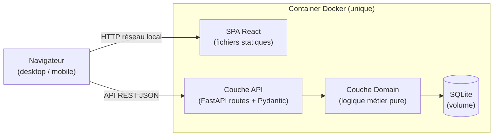
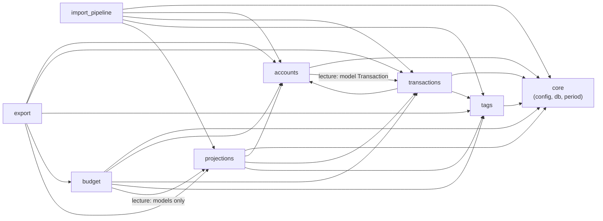

# Architecture — GestionDuBudget

> Ce document est la documentation d'architecture **vivante**, dérivée du code réel (scan complet, 2026-07-10). Le contrat d'architecture normatif (invariants, ce qui est interdit) reste [`_bmad-output/planning-artifacts/architecture/architecture-GestionDuBudget-2026-06-30/ARCHITECTURE-SPINE.md`](../_bmad-output/planning-artifacts/architecture/architecture-GestionDuBudget-2026-06-30/ARCHITECTURE-SPINE.md) — ce fichier-ci en est la vue AI-context/onboarding, complétée par le détail d'implémentation.

## Paradigme

**Monolithe en couches (Domain + API + SPA), processus unique, base SQLite unique.** Un seul conteneur Docker : backend FastAPI (Python) qui sert aussi les fichiers statiques buildés du frontend React.



Aucune authentification (usage réseau local uniquement). Pas de worker séparé, pas de queue, pas de cache externe (Redis) — tout calcul est synchrone dans la requête HTTP.

---

## Stack technique

| Catégorie | Techno | Version |
|---|---|---|
| Langage backend | Python | 3.13/3.14 |
| Framework API | FastAPI | 0.138.2 |
| ORM | SQLAlchemy | 2.0.51 |
| Migrations | Alembic | 1.18.5 |
| Config | pydantic-settings | 2.14.2 |
| Parsing OFX | ofxtools | 0.9.5 |
| Base de données | SQLite | (fichier, volume Docker) |
| Framework frontend | React | 19.2.7 |
| Langage frontend | TypeScript | ~5.9.3 |
| Build tool | Vite | ^8.1.1 |
| CSS | Tailwind CSS | ^4.3.2 (CSS-first, sans config JS) |
| Routing frontend | react-router | ^7.18.1 |
| Lint frontend | oxlint | ^1.71.0 |
| Conteneurisation | Docker | 27+ |

---

## Frontières des modules backend (8 modules)



Ownership des entités (un seul module propriétaire en écriture par entité) :

| Entité | Module propriétaire | Clé |
|---|---|---|
| `Account` | `accounts` | `account_id` |
| `Transaction` | `transactions` | `transaction_id` |
| `Tag`, `Rule` | `tags` | `tag_id`, `rule_id` |
| `Revenue`, `BudgetTarget` | `budget` | `(account_id, period_start)`, `(tag_id, account_id)` |
| `RecurringTransaction`, `PlannedExpense`, `RecurringMatch` | `projections` | `recurring_id`, `expense_id`, `match_id` |

Les modules lecteurs passent par SQLAlchemy directement (pas d'appel de fonction inter-module pour la lecture) — ex. `budget` importe les classes ORM de `projections.model` pour requêter `PlannedExpense`/`RecurringTransaction`/`RecurringMatch`, mais n'appelle jamais `projections.service`.

---

## Logique métier notable

### Période budgétaire (`core.period.period_for`)
Pas de table `Period` en base. La période active d'un compte se calcule dynamiquement à partir de `account.start_day` (1-28) et d'une date de référence : `period_for(start_day, reference_date) → (period_start, period_end)`. Fonction unique, appelée par tous les modules qui filtrent par période.

### Moteur de règles d'auto-tagging (AD-6 — Strategy pattern)
`app/tags/rule_engine/dispatcher.py` : table de dispatch `{"label_contains": evaluate_label_contains, "payee_exact": evaluate_payee_exact}`. Les règles sont évaluées dans l'ordre de `sort_order` ; la **première** qui matche fournit le tag (exactement un tag auto-appliqué, ou zéro). Ajouter un type de condition = ajouter une fonction évaluateur + l'enregistrer dans le registre, sans toucher au dispatcher.

### Pipeline d'import atomique (AD-7)
`import_pipeline.pipeline` exécute parse → dédoublonnage → application des règles → persistance dans une seule transaction SQLAlchemy (`db.flush()` par ligne pour obtenir l'ID FK, un seul `db.commit()` final). Toute exception déclenche un rollback complet — **aucun import partiel possible**. Dédoublonnage OFX par `fitid` (déjà en base pour ce compte, ou déjà vu dans le batch courant) ; le CSV n'a pas de dédoublonnage (pas de fitid), seulement un comptage des lignes ignorées (date/montant illisible ou libellé vide).

### Calcul du Disponible (AD-9)
```
Disponible = Revenus − Charges récurrentes − Dépenses planifiées − Dépenses courantes
```
- **Revenus** = salaire effectif de la période (correction ponctuelle si elle existe, sinon référence permanente) + rentrées ponctuelles de la période.
- **Charges récurrentes** : chaque récurrente confirmée compte **au plus une fois par période** — montant réel si rapprochée (`RecurringMatch` confirmé) à une transaction de la période, sinon montant projeté (calculé par avancement de périodicité depuis une date d'ancrage). Les récurrentes déjà rapprochées (pending ou confirmed) dans la période sont exclues de la projection pour éviter un double comptage.
- **Dépenses planifiées** = somme des `PlannedExpense` dont la date tombe dans la période (fractions de dépenses ventilées incluses).
- **Dépenses courantes** = somme des transactions négatives de la période **non** déjà rapprochées à une récurrente confirmée.

L'ancrage des récurrentes (`_recurring_anchor_dates_by_signature`) est calculé en une seule requête batchée pour toutes les signatures — optimisation explicite anti-N+1 (voir `_bmad-output/implementation-artifacts/spec-recurring-anchor-n-plus-one.md`).

### Cibles budgétaires et rollup hiérarchique (`_spent_by_tag_for_period`)
Le "dépensé" d'un tag parent inclut le dépensé de tous ses descendants (remontée le long de `parent_id`), mais chaque transaction ne contribue **qu'une fois par ancêtre-ou-soi** (dédoublonnage par `set`) même si elle porte à la fois un tag et un de ses ancêtres. Projection linéaire uniquement pour la période en cours : `projection = spent / jours_écoulés × jours_totaux` (arrondi `ROUND_HALF_UP`).

### Rapprochement automatique (AD-10)
Déclenché dans la **couche API** (jamais dans Domain) après toute création/import de transaction — `router` appelle `projections.rapprochement.propose_if_match(transaction_id, db)`, qui relit la transaction par ID (pas de passage d'objet inter-module, évite le cycle `transactions → projections → transactions`). Best-effort : toute exception est avalée après rollback (une transaction déjà committée ne doit jamais échouer à cause d'une proposition de rapprochement). Tolérances par défaut : ± 3 jours, ± 2,00 € — première récurrente confirmée qui matche la signature l'emporte.

### Dépenses planifiées ventilées (AD-11)
Une dépense ventilée sur N périodes = N lignes `PlannedExpense` distinctes, `series_id` (UUID) commun, `period_index ∈ [1,N]`. Répartition : `base = ROUND_HALF_UP(total/N, 2)` pour les N-1 premières lignes, la **dernière absorbe le reliquat d'arrondi** (`amounts[-1] = -total - somme(autres)`) — la somme des lignes est garantie exactement égale au total, aucun centime perdu ou gagné. Supprimer une ligne de série supprime toute la série.

### Détection des transactions récurrentes
Groupe les transactions négatives par signature (payee normalisé, ou label si pas de payee), exige ≥ 3 occurrences, exclut les signatures déjà `confirmed`/`rejected`. Classifie la périodicité par intervalle en jours entre occurrences consécutives (hebdo 6-8j, mensuelle 27-32j, trimestrielle 85-95j, annuelle 355-375j) — rejette le groupe si les intervalles ne tombent pas tous dans le même bucket. Montant de référence = médiane ; rejette si un montant dévie de la médiane au-delà de `tolerance_percentage`. Suggère un tag via le moteur de règles.

### PRAGMA foreign_keys
SQLite désactive l'application des FK par défaut. `app/core/db.py` force `PRAGMA foreign_keys=ON` sur chaque connexion via un event listener SQLAlchemy (`@event.listens_for(Engine, "connect")`) — Alembic ne l'active pas lui-même.

---

## Frontend ↔ Backend : intégration

- **Un seul processus** sert les deux : `FastAPI.frontend("/", directory=dist, fallback="index.html")` (méthode native FastAPI 0.138.2) monte le build Vite en fallback basse priorité — les routes API FastAPI sont toujours vérifiées en premier ; tout chemin non matché sert `index.html` (routing côté client SPA).
- **Collision de routes** : `GET /transactions` et `GET /projection` partagent un préfixe avec des routes SPA de même forme. Ces deux routers implémentent une négociation de contenu manuelle (`Accept: text/html`) : sans `account_id`, ils servent `dist/index.html` au lieu de renvoyer un 422, pour supporter le refresh navigateur sur ces pages.
- **Enveloppe de réponse** : toutes les réponses JSON sont `{"data": ...}` (succès) ou `{"detail": "message"}` (erreur), y compris les 422 de validation (normalisés en une chaîne unique par un handler custom, au lieu du format liste-d'objets FastAPI par défaut). Le frontend déballe via `unwrap<T>()` (`frontend/src/api/http.ts`), commun à tous les wrappers API.
- **Aucune mutation client-side d'agrégats** — le frontend ne reçoit que des résultats déjà calculés (Disponible, soldes, répartitions, projections) ; toute modification déclenche un re-fetch.
  - **Exception sanctionnée** : les pages *sandbox* de simulation (ex. `frontend/src/pages/Simulation.tsx`) recalculent une formule d'agrégat côté client sur des valeurs fictives saisies par l'utilisateur — jamais sur les entités réelles, aucun appel API/backend, rien n'est persisté. Cette exception ne couvre que ce cas d'usage ; l'affichage de données réelles reste soumis à l'invariant ci-dessus.

---

## Conventions transverses

| Sujet | Convention |
|---|---|
| Nommage fichiers | `snake_case` Python ; `PascalCase` fichiers et composants React |
| Nommage entités DB | `snake_case`, tables au pluriel |
| IDs | Entiers auto-incrémentés (pas d'UUID) |
| Dates | `DATE` ISO-8601 en base ; montants toujours `DECIMAL(12,2)` / `Decimal`, jamais `float` |
| Enveloppe API | `{data: …}` succès, `{detail: "…"}` erreur |
| Config | Variables d'environnement uniquement, validées par `pydantic-settings` |
| Auth | Aucune (réseau local) |
| CSS | Tailwind CSS 4 (CSS-first, `@theme`), breakpoints `sm`/`lg` |

---

## Déploiement

Build multi-stage (`Dockerfile`) : stage 1 build le frontend (Node 24, `npm ci && npm run build` → `dist/`), stage 2 copie le backend Python + le `dist/` buildé dans une image `python:3.13.14-slim`. `entrypoint.sh` exécute `alembic upgrade head` puis lance `uvicorn`. Un seul conteneur, un seul volume nommé (`gestion_budget_data`) pour la base SQLite. Port `8082`. Voir [deployment-guide.md](./deployment-guide.md).

## Tests

Suite pytest backend (~421 tests, 49 fichiers) : chaque fichier `test_*_api.py` définit sa propre fixture `client(tmp_path)` (base SQLite temporaire isolée, seed des 3 comptes, override de `get_db`). Les fichiers `test_*_migration.py` exécutent `alembic upgrade head` en sous-processus contre une base temporaire et inspectent le schéma résultant (types de colonnes, FK) — vérifient explicitement la convention "jamais de `float` pour les montants". Voir [development-guide.md](./development-guide.md).
