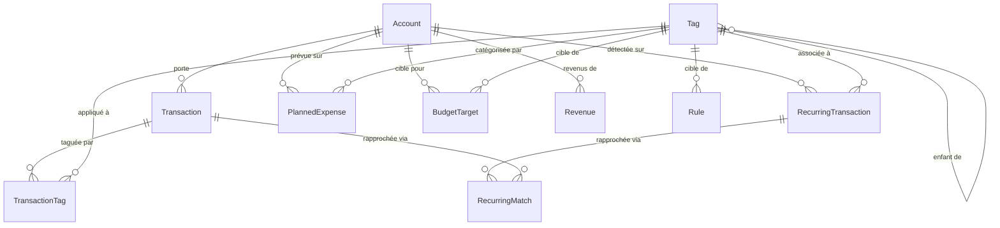

# Modèles de données — GestionDuBudget

> Backend : SQLAlchemy 2.0 (Declarative) + Alembic + SQLite. Aucun UUID (IDs entiers auto-incrémentés — base locale, pas de fusion distribuée). Montants toujours en `NUMERIC(12,2)` / `Decimal` côté Python — jamais de `float` (convention vérifiée par les tests de migration).

## Vue d'ensemble (ERD)

Application des clés étrangères : SQLite désactive `PRAGMA foreign_keys` par défaut. Un event listener SQLAlchemy (`app/core/db.py`, `@event.listens_for(Engine, "connect")`) force `PRAGMA foreign_keys=ON` sur **chaque** nouvelle connexion DBAPI — Alembic ne le fait pas lui-même, seul le moteur applicatif l'active.

---

## `accounts` (module `accounts`)

| Colonne | Type | Contraintes |
|---|---|---|
| `account_id` | `INTEGER` | PK |
| `name` | `TEXT` | NOT NULL, UNIQUE |
| `is_common` | `BOOLEAN` | NOT NULL (défaut `False` côté Python) |
| `start_day` | `INTEGER` | NOT NULL, CHECK `1 <= start_day <= 28` (`ck_accounts_start_day_range`) |
| `reference_balance` | `NUMERIC(12,2)` | NULL |
| `reference_date` | `DATE` | NULL |

Pas de `relationship()` ORM déclarée vers `Transaction` (lu directement via requête SQL dans `accounts.service.compute_balance`).

**Données de seed** (migration `e2af66951283`, insérées à la migration, non configurables) :

| name | is_common | start_day |
|---|---|---|
| Personnel-Lui | false | 1 |
| Personnel-Elle | false | 1 |
| Commun | true | 1 |

---

## `transactions` (module `transactions`)

| Colonne | Type | Contraintes |
|---|---|---|
| `transaction_id` | `INTEGER` | PK |
| `account_id` | `INTEGER` | NOT NULL, FK → `accounts.account_id` |
| `date` | `DATE` | NOT NULL |
| `amount` | `NUMERIC(12,2)` | NOT NULL — signé (négatif = dépense) |
| `label` | `TEXT` | NOT NULL |
| `payee` | `TEXT` | NULL |
| `fitid` | `TEXT` | NULL — clé de dédoublonnage OFX (migration `5c9ddfffa47c`) |

Relationship `tags` : many-to-many vers `Tag` via `transaction_tags`, `viewonly=True`, `order_by=Tag.tag_id`.

Suppression d'une transaction : les lignes `transaction_tags` et `recurring_matches` liées sont supprimées explicitement en code (aucun `ON DELETE CASCADE` déclaré en base).

---

## `transaction_tags` (table d'association)

| Colonne | Type | Contraintes |
|---|---|---|
| `transaction_id` | `INTEGER` | PK (composite), FK → `transactions.transaction_id` |
| `tag_id` | `INTEGER` | PK (composite), FK → `tags.tag_id` |

Clé primaire composite `(transaction_id, tag_id)` — une transaction ne peut avoir le même tag qu'une fois. L'ajout est idempotent côté service (une `IntegrityError` de doublon est avalée).

---

## `tags` (module `tags`)

| Colonne | Type | Contraintes |
|---|---|---|
| `tag_id` | `INTEGER` | PK |
| `name` | `TEXT` | NOT NULL |
| `parent_id` | `INTEGER` | NULL, FK → `tags.tag_id` (auto-référence) |
| `level` | `INTEGER` | NOT NULL, CHECK `1 <= level <= 3` (`ck_tags_level_range`) |

Pas de `relationship()` ORM auto-référentielle — l'arbre est parcouru manuellement en service (`parent_id` chain walking). `MAX_LEVEL = 3` est une constante Python dans `model.py`, explicitement documentée comme devant rester synchronisée avec la contrainte CHECK figée dans la migration `8c4771f6ec20`.

Suppression : refusée si le tag a des enfants (message d'erreur applicatif), et protégée en base par FK si le tag est référencé par une transaction, une règle, une cible, une récurrente ou une dépense planifiée (message 422 listant les types d'entités dépendantes).

---

## `rules` (module `tags`, moteur de règles)

| Colonne | Type | Contraintes |
|---|---|---|
| `rule_id` | `INTEGER` | PK |
| `condition_type` | `TEXT` | NOT NULL, CHECK `IN ('label_contains', 'payee_exact')` |
| `condition_value` | `TEXT` | NOT NULL |
| `tag_id` | `INTEGER` | NOT NULL, FK → `tags.tag_id` |
| `sort_order` | `INTEGER` | NOT NULL |

L'ordre (`sort_order`) détermine la priorité d'évaluation — la première règle qui matche l'emporte (voir [architecture.md](./architecture.md), AD-6). Modifiable uniquement via `PUT /rules/reorder` (jamais via `PUT /rules/{id}`).

---

## `revenues` (module `budget`)

| Colonne | Type | Contraintes |
|---|---|---|
| `revenue_id` | `INTEGER` | PK |
| `account_id` | `INTEGER` | NOT NULL, FK → `accounts.account_id` |
| `period_start` | `DATE` | NULL — `NULL` = salaire de référence permanent ; non-null = correction ponctuelle pour une période, ou rentrée ponctuelle |
| `kind` | `TEXT` | NOT NULL, CHECK `IN ('salaire', 'ponctuel')` |
| `amount` | `NUMERIC(12,2)` | NOT NULL |
| `description` | `TEXT` | NULL |

Clé logique d'upsert pour `kind='salaire'` : `(account_id, period_start)`. Réservé aux comptes personnels (`is_common=False`) — 422 si le compte est le Compte Commun.

---

## `budget_targets` (module `budget`)

| Colonne | Type | Contraintes |
|---|---|---|
| `target_id` | `INTEGER` | PK |
| `tag_id` | `INTEGER` | NOT NULL, FK → `tags.tag_id` |
| `account_id` | `INTEGER` | NOT NULL, FK → `accounts.account_id` |
| `percentage` | `NUMERIC(5,2)` | NOT NULL — `0 < percentage <= 100` (validé au niveau schéma Pydantic) |

Clé logique d'upsert : `(account_id, tag_id)`.

---

## `recurring_transactions` (module `projections`)

| Colonne | Type | Contraintes |
|---|---|---|
| `recurring_id` | `INTEGER` | PK |
| `account_id` | `INTEGER` | NOT NULL, FK → `accounts.account_id` |
| `tag_id` | `INTEGER` | NULL, FK → `tags.tag_id` |
| `signature` | `TEXT` | NOT NULL — payee/label normalisé, utilisé pour le groupement/matching |
| `label` | `TEXT` | NOT NULL |
| `amount` | `NUMERIC(12,2)` | NOT NULL |
| `periodicity` | `TEXT` | NOT NULL, CHECK `IN ('hebdomadaire','mensuelle','trimestrielle','annuelle')` |
| `status` | `TEXT` | NOT NULL, CHECK `IN ('confirmed','rejected')` |

Une signature `rejected` n'est plus jamais re-suggérée par la détection de candidats.

---

## `recurring_matches` (module `projections`)

| Colonne | Type | Contraintes |
|---|---|---|
| `match_id` | `INTEGER` | PK |
| `recurring_id` | `INTEGER` | NOT NULL, FK → `recurring_transactions.recurring_id` |
| `transaction_id` | `INTEGER` | NOT NULL, FK → `transactions.transaction_id`, **UNIQUE** |
| `status` | `TEXT` | NOT NULL, CHECK `IN ('pending','confirmed','rejected')` |

`transaction_id` est `UNIQUE` : une transaction ne peut être rapprochée que d'une seule récurrente. Le rejet (`DELETE /rapprochement/{id}`) est un soft-update (`status='rejected'`), pas une suppression en base.

---

## `planned_expenses` (module `projections`)

| Colonne | Type | Contraintes |
|---|---|---|
| `expense_id` | `INTEGER` | PK |
| `account_id` | `INTEGER` | NOT NULL, FK → `accounts.account_id` |
| `tag_id` | `INTEGER` | NOT NULL, FK → `tags.tag_id` |
| `series_id` | `TEXT` | NULL — UUID commun aux fractions d'une dépense ventilée |
| `period_index` | `INTEGER` | NULL — position dans la série (1..N) |
| `total_periods` | `INTEGER` | NULL — taille totale de la série |
| `amount` | `NUMERIC(12,2)` | NOT NULL |
| `date` | `DATE` | NOT NULL |
| `description` | `TEXT` | NOT NULL |

Une dépense ventilée sur N périodes = N lignes distinctes partageant le même `series_id`. Supprimer une ligne de série supprime **toute la série**. Le dernier versement absorbe l'arrondi (voir [architecture.md](./architecture.md) — algorithme de répartition).

---

## Historique des migrations Alembic

12 migrations, chaîne linéaire (une seule tête, pas de branche), dans `backend/alembic/versions/`.

| # | Révision | Contenu |
|---|---|---|
| 1 | `9dd12ce4bbba` | Initiale (placeholder, upgrade/downgrade vides) |
| 2 | `e2af66951283` | Table `accounts` + seed des 3 comptes |
| 3 | `61b1207be884` | Table `transactions` (FK → accounts) |
| 4 | `8c4771f6ec20` | Table `tags` (auto-référence, `ck_tags_level_range` 1-3) |
| 5 | `0de490e8eb3f` | Table `transaction_tags` (PK composite) |
| 6 | `6b2faef3e64f` | Table `rules` |
| 7 | `5c9ddfffa47c` | Ajout `fitid` sur `transactions` |
| 8 | `f3a7c1d9b2e4` | Table `revenues` |
| 9 | `0c7cb82f61d9` | Table `budget_targets` |
| 10 | `660864ca9d6f` | Table `recurring_transactions` |
| 11 | `7d2f4a1b9c3e` | Table `planned_expenses` |
| 12 | `9a1e5f6b2c8d` | Table `recurring_matches` (UNIQUE sur `transaction_id`) |

`env.py` résout l'URL de la base **exclusivement** via `app.core.config.settings` (variable d'environnement `DATABASE_PATH`), jamais via `alembic.ini` — c'est ce qui permet aux tests de migration de pointer Alembic vers une base temporaire (`DATABASE_PATH=<tmp> alembic upgrade head` en sous-processus).

Commande : `alembic upgrade head` (depuis `backend/`, exécuté aussi à chaque démarrage via `entrypoint.sh`).
